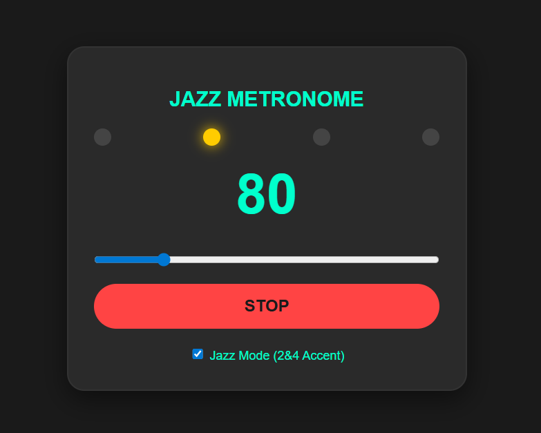

# Jazz Muscle Metronome
サックス奏者のための、2拍目・4拍目の「バックビート」を体得することに特化した、Webベースのジャズ・メトロノームです。

## 特徴
### 1. ジャズ・バックビート強調モード
通常のメトロノームとは異なり、2拍目と4拍目にアクセント（高音＋ハイハット音）を配置。

8分音符単位の内部カウントにより、1拍目の裏や2拍目の表といった、ジャズ特有のタイミングを正確に刻みます。

### 2. スイング・フィールの視覚化
4つのビート・ドットがリズムに合わせてネオンカラーで点滅。

アクセント拍は異なる色（オレンジ）で光るため、視覚的にも2・4拍目を意識した練習が可能です。

### 3. 高精度な Web Audio API (Tone.js) 採用
ブラウザのタイマーに依存しない、音楽制作レベルの精密なタイミングを実現。

遅延の少ないオーディオ再生により、サックスの演奏を妨げないクリアなクリック音を提供します。

### 4. インストール不要の Web 実行
PC、スマホ、タブレットのブラウザから直接アクセスしてすぐに使用可能。

ダークモードに最適化された「サックス・モチベーション・チューナー」共通のデザインを採用。

##  技術スタック
- **Framework**: Tone.js (Web Audio API Wrapper)
- **Frontend**: HTML5, CSS3, JavaScript (ES6+)

## 使い方
START ボタンを押してメトロノームを開始します（初回のみ音声の許可が必要です）。

BPMスライダー でテンポを調整します（40〜250 BPM）。

Jazz Mode チェックボックスをオンにすることで、2拍目と4拍目が強調されたジャズ仕様のリズムに切り替わります。

## 今後のロードマップ
スイング率調整機能: 8分音符の跳ね具合（50%〜75%）をユーザーが自由に変更できる機能。

トリプレット（3連符）モード: ブルースやスロー・スイングに最適な3連符刻みの追加。

モチベーション演出: リズムをキープし続けると、背景のネオンがより激しく光る演出。